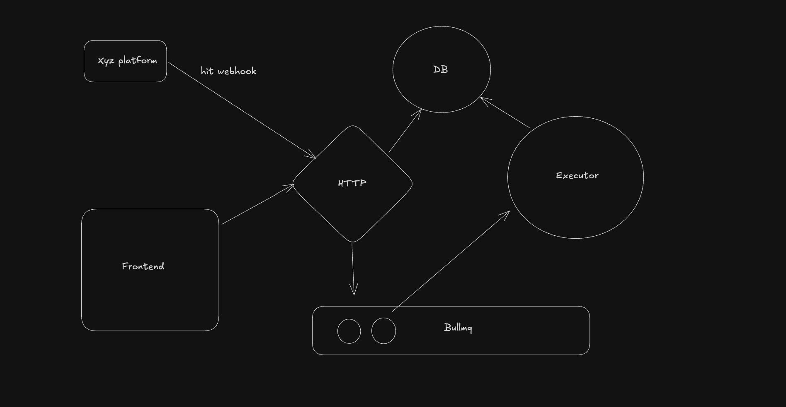
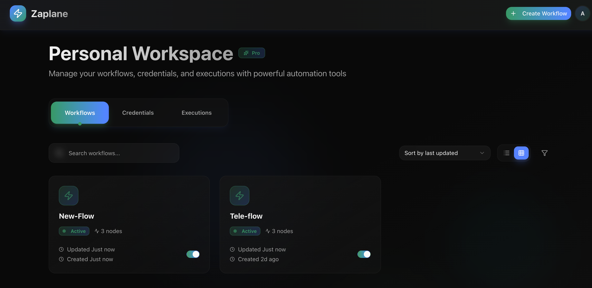
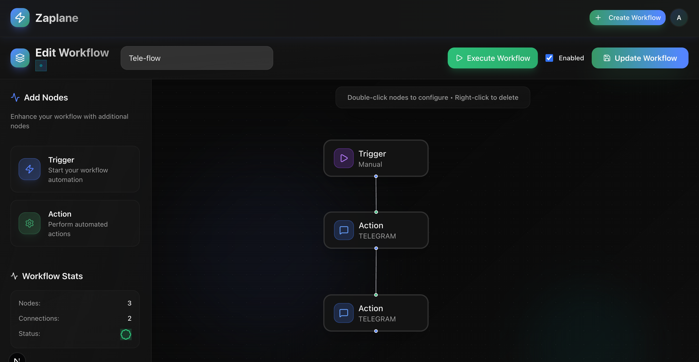
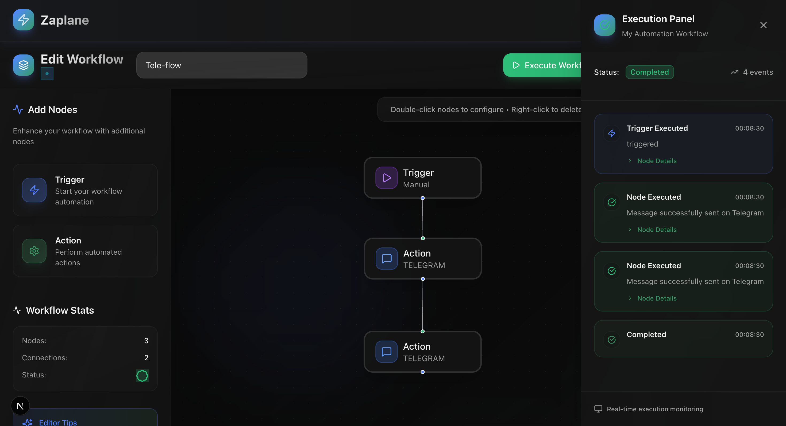

# ⚡ Zaplane – Automate Workflows with Triggers & Actions

Zaplane is an open-source automation platform to connect apps, send Telegram messages, and send emails with Resend.  
Build powerful workflows with **triggers** and **actions** in just a few clicks.  

---

## 🚀 Features
- Create and manage workflows with triggers & actions
- Connect to external services (Telegram, Email via Resend, etc.)
- Queue-based execution using **BullMQ**
- Worker system for async and scalable task execution
- User-friendly Next.js frontend
- Modular monorepo setup for easy scaling

---

## 🏗️ Architecture

**Apps in Monorepo:**
- **server** → Express.js API 
- **executor (worker)** → BullMQ-based worker to process workflows
- **frontend** → Next.js app for dashboard & workflow builder

---

## 🛠️ Tech Stack
- **Framework:** Next.js, Express.js  
- **Database:** PostgreSQL with Prisma ORM  
- **Queue:** BullMQ (Redis)  
- **Monorepo:** Turborepo  
- **Frontend Styling:** Tailwind CSS + shadcn/ui  
- **Auth:** NextAuth.js  

---

## 📸 Demo Screenshots

### Dashboard – Workflows Overview

### Workflow Builder

### Execution Details

